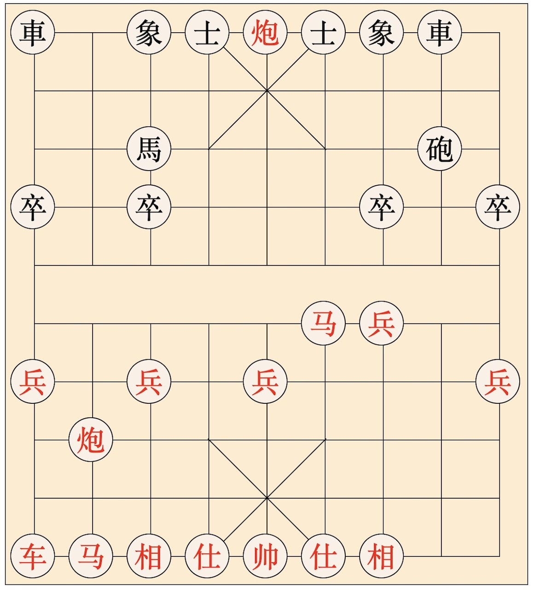

# Xiangqi (Chinese Chess)
A pure css implementation of the Chinese Chess, Xiangqi.



This library provides basic layout and move APIs of the chess map.

The core functionality is to provide UI drawings, and other optional chess rules can also be enforced if needed.

# Usage
```sh
# install dependencies
npm install

# build client
npm run build

# start server
npm run server
```

The open http://localhost:8080/chess to check the UI.

# Disclaimer
Inspired by https://github.com/leidZhang/JSXiangqi.

